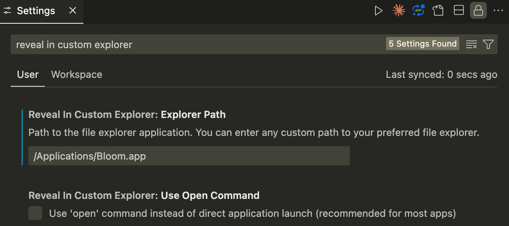

# Reveal in Custom Explorer

A VS Code extension that adds a configurable "Reveal in Custom Explorer" menu item to the Explorer context menu, allowing you to use your preferred file explorer application instead of the default Finder.



## Features

- Adds a customizable context menu item to the Explorer view
- Interactive configuration with QuickPick interface for common explorers
- Support for any file explorer application (Path Finder, Bloom, Commander One, etc.)
- Custom path input for any file explorer
- Works with both files and folders
- Cross-platform support (optimized for macOS)
- Automatic configuration prompt when no explorer is set

## Installation

1. Copy this extension folder to your VS Code extensions directory:
   - macOS: `~/.vscode/extensions/`
   - Windows: `%USERPROFILE%\.vscode\extensions\`
   - Linux: `~/.vscode/extensions/`

2. Open the extension folder in terminal and run:
   ```bash
   npm install
   npm run compile
   ```

3. Restart VS Code

## Configuration

### Interactive Configuration (Recommended)

1. Use Command Palette (`Cmd+Shift+P` / `Ctrl+Shift+P`) and run "Configure Custom Explorer"
2. Choose from common file explorers or select "Custom Path..." to enter your own
3. The extension will validate the path and save your configuration

### Manual Configuration

Alternatively, you can configure the extension manually in VS Code settings:

### `revealInCustomExplorer.explorerPath`
Path to your preferred file explorer application. You can enter any custom path to your file explorer.

**Common Examples:**
- **Finder** - `/System/Applications/Finder.app` (default)
- **Path Finder** - `/Applications/Path Finder.app`
- **Bloom** - `/Applications/Bloom.app`
- **Commander One** - `/Applications/Commander One - file manager.app`
- **ForkLift 3** - `/Applications/ForkLift 3.app`
- **muCommander** - `/Applications/muCommander.app`
- **Directory Utility** - `/Applications/Directory Utility.app`
- **Any custom explorer** - Just enter the full path to your preferred application

### `revealInCustomExplorer.useOpenCommand`
Use the `open` command instead of direct application launch. Enable this if the direct launch doesn't work with your explorer app.

## Usage

1. Right-click on any file or folder in the VS Code Explorer
2. Click on "Reveal in Custom Explorer" (or your custom menu title)
3. The file/folder will be revealed in your configured explorer application

## Configuration Examples

### For Path Finder:
```json
{
  "revealInCustomExplorer.explorerPath": "/Applications/Path Finder.app"
}
```

### For Bloom:
```json
{
  "revealInCustomExplorer.explorerPath": "/Applications/Bloom.app"
}
```

## Troubleshooting

- **App not opening**: Try enabling the `useOpenCommand` setting
- **App not found**: Verify the application path in your configuration
- **Permission issues**: Make sure the application has the necessary permissions to access files

## Requirements

- VS Code 1.74.0 or higher
- macOS (Windows and Linux support is experimental)

## Release Notes

### 1.0.0
- Initial release
- Configurable file explorer support
- Context menu integration
- Cross-platform compatibility
